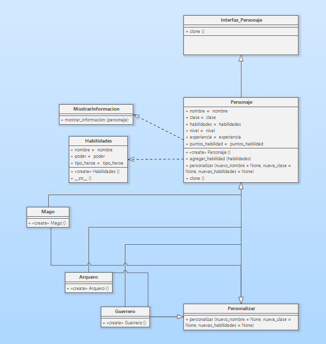

# Clonación de Personajes en un Videojuego de Aventuras

Imagina que estás desarrollando un videojuego de aventuras en el que los jugadores pueden controlar a un grupo de héroes con habilidades únicas. Necesitas implementar un sistema de clonación de personajes. Los jugadores deben poder clonar y personalizar héroes existentes para formar equipos estratégicos.

### Requerimientos del sistema:

1. Los jugadores deben poder clonar a los héroes existentes en el juego para crear nuevos personajes con habilidades idénticas.
2. Cada héroe tiene un conjunto único de habilidades especiales que incluyen ataques, defensas y habilidades mágicas.
3. Los héroes pueden pertenecer a diferentes clases, como guerreros, magos o arqueros, y cada clase tiene su propio conjunto de habilidades base.
4. Los jugadores deben poder personalizar los nombres y aspectos visuales de los héroes clonados después de la clonación.
5. Los héroes deben mantener un registro de su experiencia, nivel y puntos de habilidad, y esta información debe copiarse correctamente al clonar un héroe.
6. El sistema debe ser eficiente y permitir la creación de múltiples clones de un mismo héroe sin duplicar innecesariamente los datos.

## Solución:

### Patrón escogido: _Prototype_  
Por medio de una interfaz, este patrón permite realizar clones de los objetos sin acoplar los códigos de las clases y asi poder utilizar métodos de personalización para los super héroes escogidos; en Python lo equivalente a interfaces serian clases abstractas.

### Diagrama de clases

