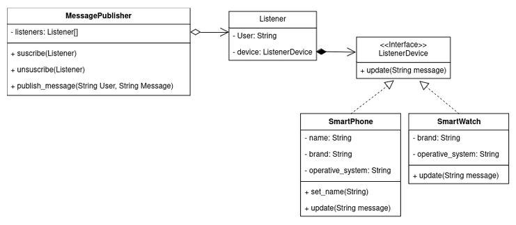

# Mensajería en Tiempo Real

La empresa está desarrollando una aplicación de mensajería en tiempo real que permite a los usuarios comunicarse desde múltiples dispositivos. Cada vez que un usuario recibe un nuevo mensaje, todos los dispositivos del usuario deben ser notificados para que el mensaje se muestre en cada uno de ellos. Para mantener la flexibilidad y desacoplar la lógica de notificación de la aplicación principal.

El patrón que escoja deberá permitir:

1. Notificación en Tiempo Real: Cada dispositivo del usuario debe recibir una notificación cuando llegue un nuevo mensaje.
2. Desacoplamiento: La aplicación de mensajería debe poder notificar a cualquier número de dispositivos sin saber detalles específicos sobre cada uno de ellos.
3. Flexibilidad: Los dispositivos pueden ser añadidos o eliminados en tiempo de ejecución sin necesidad de modificar la lógica principal de la aplicación.

## Solución:

### Patrón escogido: _Observer_
Este patrón permite definir un mecanismo de suscripción para notificar a varios objetos sobre cualquier evento que le suceda al objeto que están observando.

### Diagrama de clases

