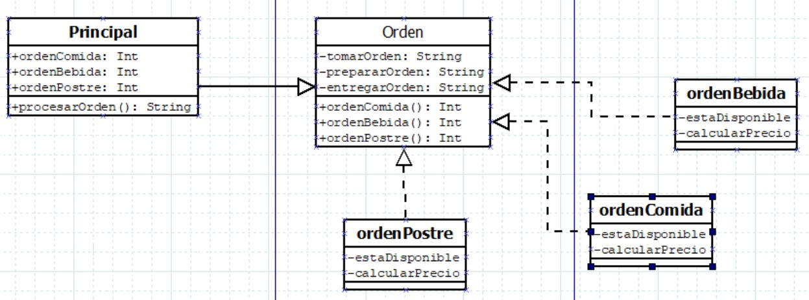

# Desarrollo de un Sistema de Gestión de Restaurantes

En un proyecto de desarrollo de software para un sistema de gestión de restaurantes, debe buscar el patrón de diseño para ser aplicado para manejar la lógica común de procesamiento de órdenes de alimentos y bebidas.

Contexto:

Imagina que estamos desarrollando un sistema de gestión de restaurantes que permite a los usuarios realizar pedidos en línea. Este sistema debe manejar una variedad de órdenes, que pueden incluir comida, bebidas y postres. Cada tipo de pedido tiene un proceso común, como la toma de pedido, la preparación, la verificación de disponibilidad, el cálculo de precios, etc.

### Aplicación del Patrón:
En este escenario, el patrón se aplicaría para definir una estructura común para el procesamiento de órdenes, mientras se permite a las subclases (por ejemplo, clase OrderFood, OrderBeverage, OrderDessert) implementar pasos específicos según el tipo de pedido.

El patrón que seleccione debe tener los siguientes beneficios:

- Encapsulación de la estructura del algoritmo común en una clase base.
- Flexibilidad para que las subclases implementen pasos específicos según el tipo de pedido.
- Evita la duplicación de código al reutilizar la estructura común.

## Solución:

### Patrón escogido: _Template Method_
Este patrón define el esqueleto de un algoritmo en la superclase pero permite que las subclases sobrescriban pasos del algoritmo sin cambiar su estructura.

### Diagrama de clases

