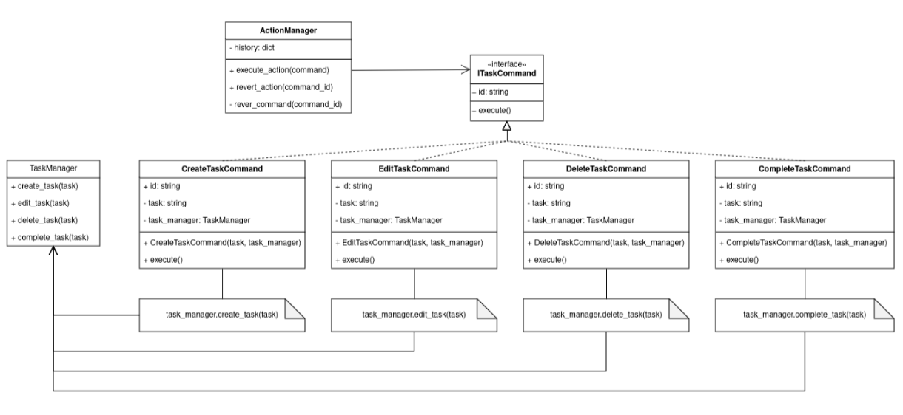

# Sistema de Gestión de Tareas

Imagina un sistema de gestión de tareas en el que los usuarios pueden crear, editar, eliminar y completar tareas. Cada acción realizada por el usuario corresponde a una acción que debe ser ejecutada. Además, es importante mantener un registro de todas las acciones realizadas para permitir la reversión de las mismas si es necesario.

### Aplicación del Patrón:

En este escenario, el patrón será aplicado para encapsular cada una de las acciones que el usuario puede realizar sobre una tarea.
El patrón que seleccione debe tener los siguientes beneficios:
- Desacopla el invocador de los objetos que realizan las acciones.
- Permite la extensión de nuevas operaciones sin modificar el código existente.
- Facilita el registro de acciones para realizar operaciones de reversión.

## Solución:

### Patrón escogido: _Command_  
Permite encapsular la solicitud como un objeto además posibilita llevar un registro de las operaciones facilitando acciones como deshacer/rehacer. Las operaciones del cliente (_invocador_) se convierten en _comandos_ específicos que van a ser ejecutados por el _receptor_, desacoplando el invocador de los objetos que realizan las operaciones y propiciando la extensión de nuevas operaciones sin modificar/afectar el código existente.

### Diagrama de clases

