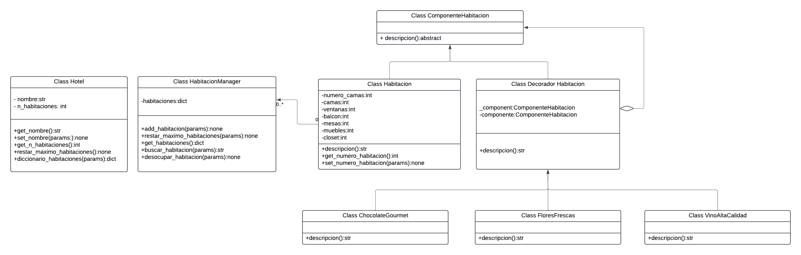

# Decoración de Habitaciones en un Hotel

Imagina que estamos desarrollando un sistema para gestionar la decoración de habitaciones en un hotel de lujo. Cada habitación puede tener una decoración básica, perolos huéspedes pueden solicitar mejoras y adiciones para personalizar su experiencia. Estas mejoras pueden incluir servicios adicionales, como flores frescas, chocolate gourmet, vino de alta calidad, etc.

### Aplicación del Patrón

En este escenario, el patrón que se seleccione se utilizará para agregar características adicionales y personalizadas a las habitaciones del hotel de manera dinámica.

El patrón que seleccione debe tener los siguientes beneficios:

- Permite agregar nuevas funcionalidades a objetos existentes de manera dinámica.
- Proporciona una alternativa flexible a la subclase para extender funcionalidades.
- Mejora la legibilidad y el mantenimiento del código al separar las preocupaciones.

## Solución:

### Patrón escogido: _Decorator_
Este patrón permite añadir funcionalidades a objetos colocando estos objetos dentro de objetos encapsuladores especiales que contienen estas funcionalidades.

### Diagrama de clases

